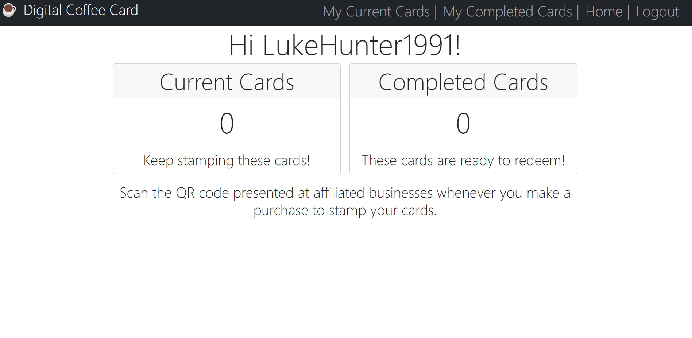

# Digital Coffee Card

Deployed URL - https://digital-coffee-card.onrender.com/

## Description

In this project I built a digital coffee card. This allows a business to create a digital card and generates a QR code. A customer can then scan that QR code to stamp their digital coffee card. Once the card has been fully stamped it will move to their completed cards page and can be redeemed at a suitable provider. I did this to gain a deeper understanding of the MERN stack tools and workflow.

- [Usage](#usage)
  
- [License](#license)

- [Badges](#badges)

- [Contribute](#contribute)

## License

This software is licensed under the MIT license.

## Usage

Up on creating a business account a QR code is generated. The business can display this QR code to their customers, and customers can scan that code to create and stamp their digital coffee cards. A customer will need to create an account and be logged in to stamp their card. The user can view their current cards page, which is their collection of cards that have been stamped but are not yet ready to be redeemed. The users completed cards page shows the cards that do have all of their stamps and so can be redeemed. The user would show their server the completed card and the server would prompt them to click the redeem button which deletes the card.

## Badges

## Contribute

Please feel free to reach out if you would like to discuss collaboration. My email is luke.hunter9@gmail.com and my github username is LukeHunter1991.
